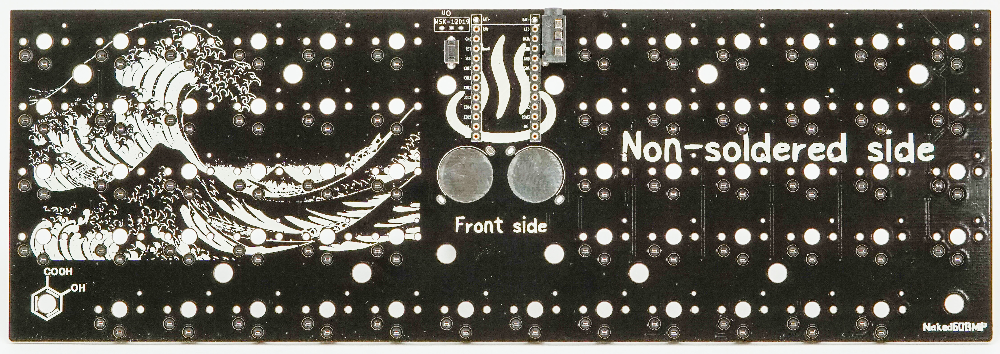

# Naked60BMP Build Guide

## Tools

* Soldering Iron
* Flush Cutters
* Scissors
* Hot Glue Gun (optional)

## Component List

* 2x Middle Art Plate - PCB
* 1x Top Plate - PCB
* 1x Main Board - PCB
* 1x Bottom Plate - PCB
* 1x Cover Support - PCB
* 1x Cover Art - PCB
* 1x Cover Fabric
* 1x Magnetic Clasp
* 1x Pro Micro or Equivalent
* 2x 12 Pin Low Profile Sockets (optional)
* 1x TRRS Jack
* 1x Reset Switch
* 60x Surface Mount Diode
* 60x Kailh Choc Sockets
* 28x M2 3mm Screw
* 2x M2 4mm Screw
* 10x M2 3.5mm Spacer
* 4x M2 10mm Spacer
* 4x Rubber Feet

## Additional Materials

* Solder
* Strong Double Sided Tape
* Waterproof Spray
* Glue for Glue Gun (optional)

## Assembled PCB Detail Photos

Use the following high resolution photo to help place the components included with the kit.

## The Build

### Install Diodes

More detailed information about soldering diodes can be found [here](../soldering-guides/smd-soldering). Be sure to add all 60 diodes.

### Install Pro Micro

Installing the Pro Micro at this time will allow for a quick test of the PCB to make sure all switch footprints respond appropriately. More detailed information about testing PCBs can be found [here](../soldering-guides/testing-pcbs).

### Install Hotswap Sockets

### Install Switches

Now is a good time to remove the small stabilizer bar that comes installed on linear and tactile choc switches. This is optional, but it removes the rattling sound when typing or just moving the keyboard.

### Prepare Cover

Now is a good time to spray the alcantara material with waterproofing spray. This is an optional step, but could be be handy in the event of an accidental spill.

### Prepare Bottom Plate

Double sided tape should be applied to the top edge of the back plate. Be careful not to cover the screw holes. **Don't remove the backing tape.**

This step should be skipped if the Yukata Cover may be removed in the future. If skipped, the cover will open wider than designed.

### Screw the Cover Fabric on to the Bottom Plate

Start by adding screws to the four corners of the board. It helps to thread the screw through the cover material first and then through the PCB.

If there are wrinkles in the fabric, loosen the screws and retighten after flattening the cover.

### Remove Backing Tape from Bottom Plate

Once removed, carefully press the cover fabric onto the PCB. Be careful not to create wrinkles. Peel up on the fabric and reapply if wrinkles appear.

### Place Keyboard on Bottom Plate

Don't screw down the sides or bottom yet.

### Add Double Sided Tape to Cover Fabric

### Screw Sides of Cover Fabric on to Switch Plate

Remove the double sided tape on the side being worked on and fold the fabric over the switches. Use 3mm screws to attach the fabric to the Switch Plate.

The top corner of each side will require very strong double sided tape or hot glue to keep the cover fabric attached to the keyboard.

### Screw Bottom of Cover Fabric on to Switch Plate

Remove the backing from the double sided tape and screw the fabric down on to the switch plate. It helps to work from the middle out.

Use the 4mm screws on the bottom corners of the keyboard.

### Attach the Magnetic Clasp to the Middle Art Plate

The female side of the clasp should be attached to the middle plate. Try to spread the legs out as far as possible to tightly hold the clasp to the PCB. Some tape could help secure things if they feel loose.

### Prepare the Cover Art Plate

Attach the male side of the magnetic clasp to the Cover Art Plate. Again, try to spread those legs out as wide as possible.

As a test, place the Cover Support Plate onto the Cover Art Plate. If the clasp sticks out past the Support Plate, there is a chance it will show when the cover fabric is applied on top. Try to spread those legs out as wide as possible.

### Prepare the Cover Support Plate

Be generous with the tape, but only apply a single layer. Any gaps in the tape can show through when the Cover Fabric is applied, so try to keep the tape as close as possible.

Fold extra tape around the backside of the plate. It will be useful later when adhering the edges of the cover fabric.

### Carefully adhere the Cover Support Plate to Cover Fabric

Take your time.

Remove the backing material from the tape and align the bottom corners of the Support Plate to the Cover Fabric. Gently lay the Support Plate onto the Cover Fabric.

Check the alignment and adjust if necessary. Once all is well, press down on the Support Plate to firmly adhere it to the fabric. Whew.

### Fold Cover Fabric Over the Support Plate

Once folded over, apply double sided tape to the Support Plate. Covering the fabric edges with the tape is recommended and will help keep the edges in place.

### Adhere the Cover Art Plate to the Support Plate

Align the bottoms and gently lay it down.

### Install the Middle Art Plate

### Install Keycaps

### Install the Rubber Feet

### Celebrate

It wasn't easy, but it sure was worth it. Take a picture.